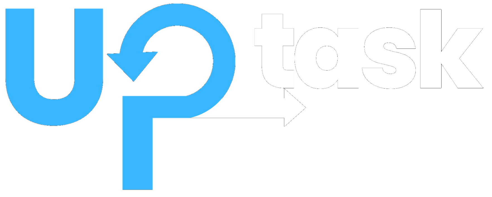
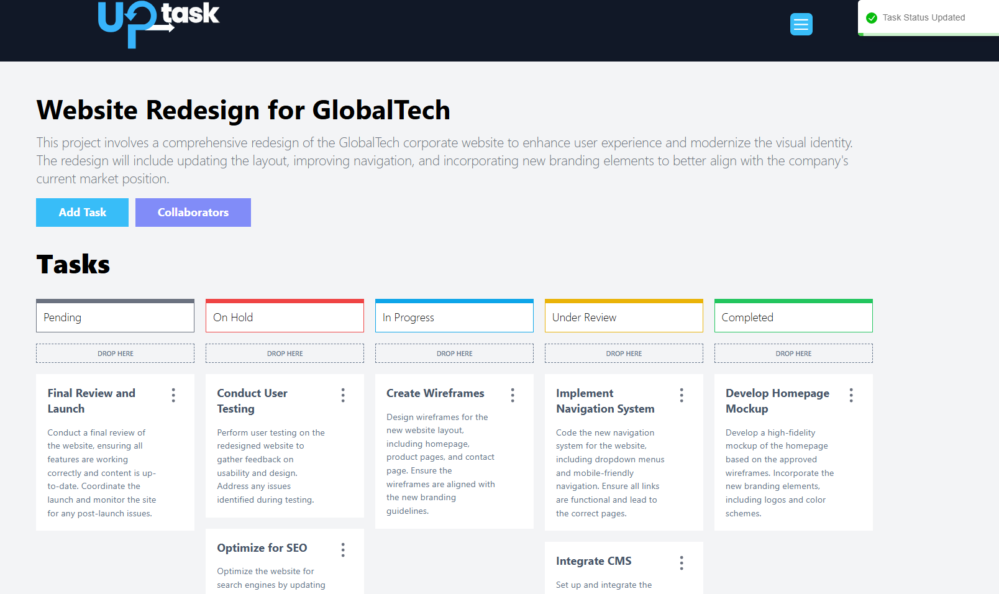
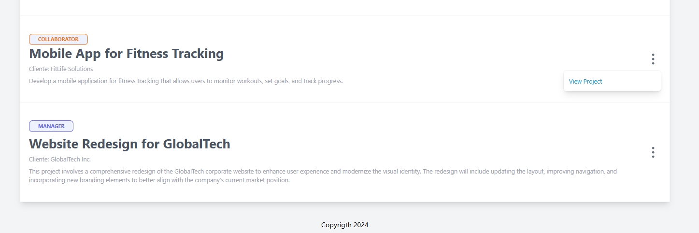
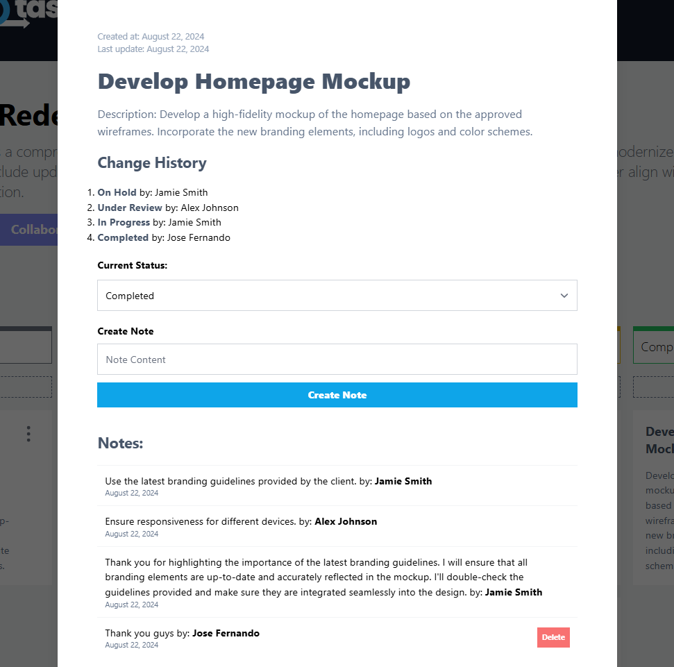

# UP task


<div align="center">
  
</div>

## React + React Query + React Hook Form + Express + Typescript + MongoDB & More!
<div align="center">
    
</div>


## Get started with the demo: [Here](https://uptask-frontend-ten.vercel.app)✨
You can use the following credentials to test the application.
- user: alex@email.com | password: adminadmin
- user: jamie@email.com | password: adminadmin
- user: taylor@email.com | password: adminadmin

## Project Description

This project is a task management application, designed to function as a Kanban board, allowing users to create, organize, and track their tasks efficiently. Developed with React, Zod, React Query, Express, Node.js, TypeScript, MongoDB, and Tailwind CSS, the application demonstrates a strong grasp of both front-end and back-end technologies. Following Agile principles and the SCRUM methodology, I managed the entire development process, ensuring iterative progress and effective collaboration. This project showcases my ability to deliver high-quality software solutions in a dynamic, agile environment.


<div align="center">
  
</div>

## Docs

- [Doc API](https://documenter.getpostman.com/view/32058825/2sAXjF8F16)
- [IMG Resources](https://drive.google.com/drive/folders/1YwFhxjxulRxJa4_ociY79lHGho1qs86B?usp=sharing)
- [Demo](https://uptask-frontend-ten.vercel.app/)

  
## What did I learn or practice?

In this project, I learned and practiced:
- useState
- useEffect
- Hooks
- customHook
- useReducer
- ReactQuery
- useMutation
- useQuery
- useQueryClient / invalidate queries
- Best Practices for Express.js & React
- react dependencies
- docker
- Clean Architecture
- Clean Code & Dessing Patterns
- Work with components

## Some features:
### Role Managment
<div align="center">
  
</div>

### Create and manage your task in detail
<div align="center">
  
</div>


## Prerequisites

Make sure you have the following installed:

- [Node.js](https://nodejs.org/) (version 14 or higher)
- [npm](https://www.npmjs.com/) or [yarn](https://yarnpkg.com/)


## Installation

Follow these steps to set up the project locally:

1. Clone the repository:
    ```bash
    git clone https://github.com/josefer09/uptask_backend
    git clone https://github.com/josefer09/uptask_frontend
    cd your-repository
    ```

2. initialize docker:
    ```bash
    cd backend
    docker compose up -d
    ```

3. Install the dependencies:
    ```bash
    npm install
    # or if you use yarn
    yarn install
    ```

4. Run projects:
    ```bash
    npm run dev
    ```

## Contact

Thank you for visiting the UpTask repository! If you have any questions, suggestions, or just want to say hello, feel free to get in touch with me.

- **email:** [josefer.hdeza@hotmail.com](mailto:josefer.hdeza@hotmail.com)
- **LinkedIn:** [Jose Fernando Hernandez](https://www.linkedin.com/in/jos%C3%A9-fernando-hernandez-angulo-7862882b9/)
